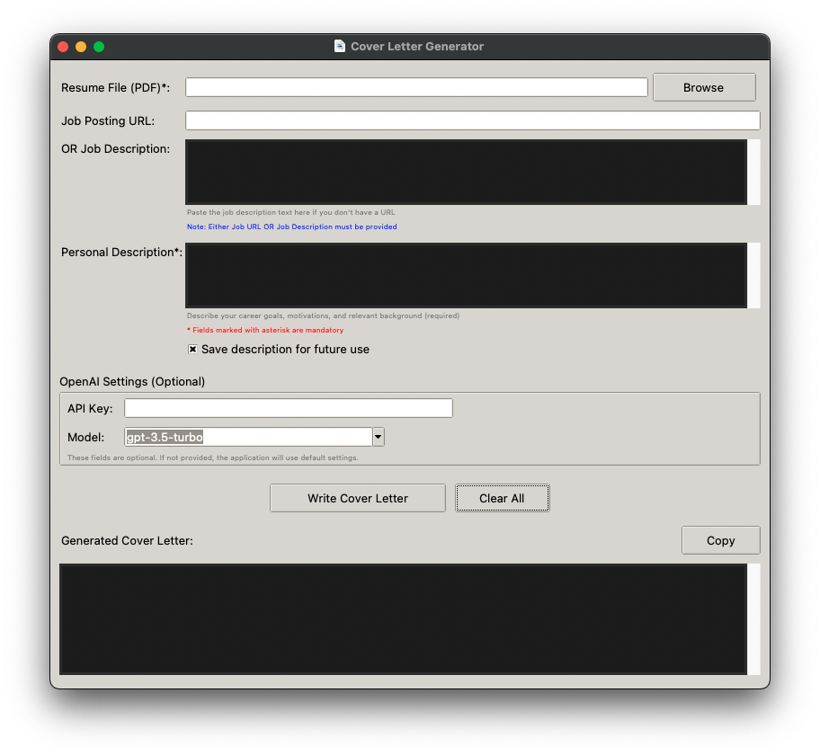

# Cover-Letter-Agent
A multi-agent system that writes a cover letter for a job position adapted to a job applicant.

## Installation
To install the program:
1. Open a shell
2. Clone this repository using `git clone https://github.com/pierclgr/Cover-Letter-Agent.git`
3. Move to the project folder using `cd ./Cover-Letter-Agent`
4. Make the installation script executable using `chmod +x ./setup.sh`
5. Run the installation script using `./setup.sh`

## Execution
To execute the program, after running the setup:
1. Open a shell
2. Make the installation script executable using `chmod +x ./run.sh`
3. Run the execution script using `./run.sh`

## Screenshots
